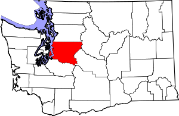
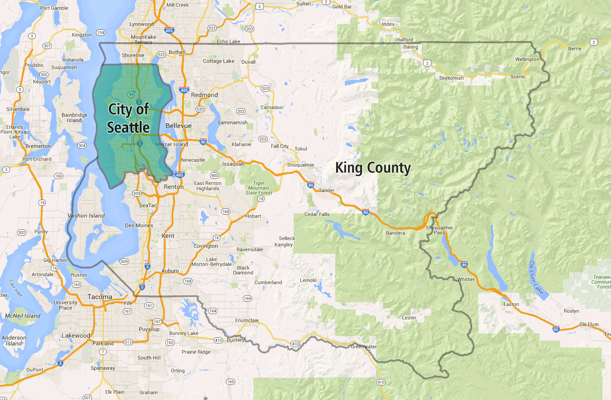
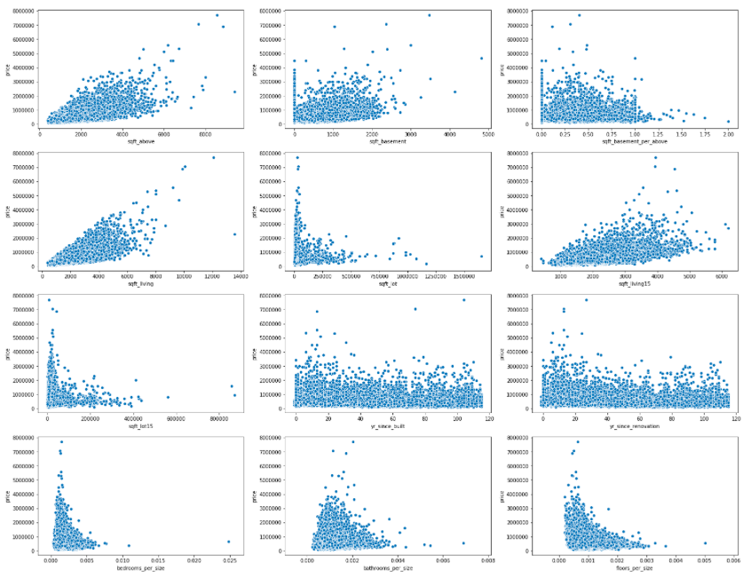
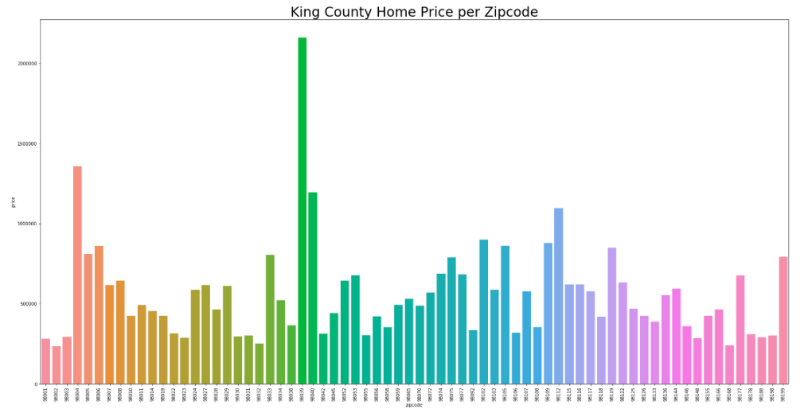
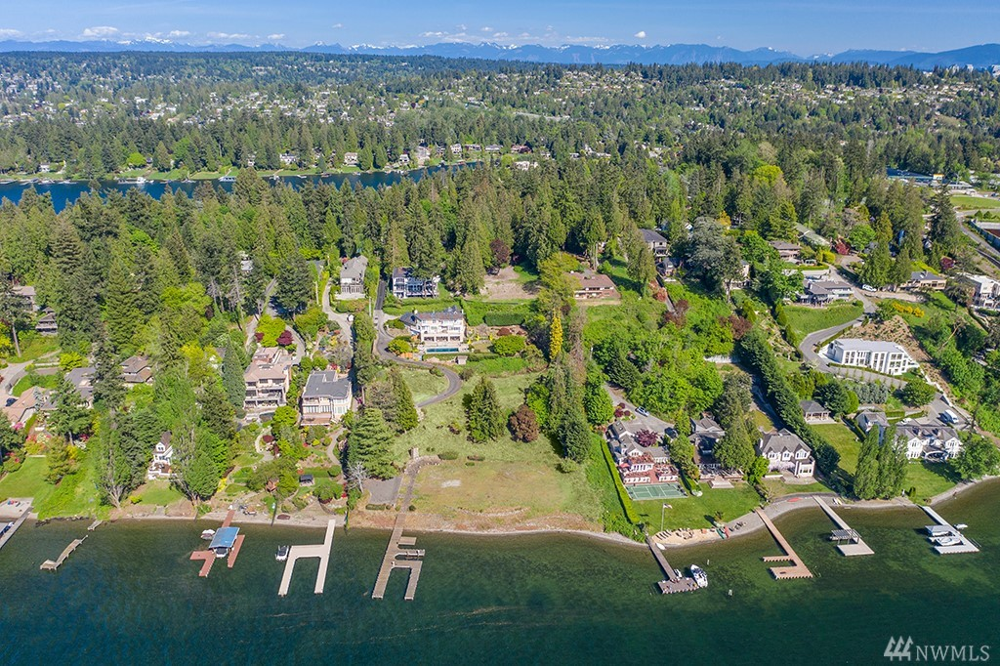
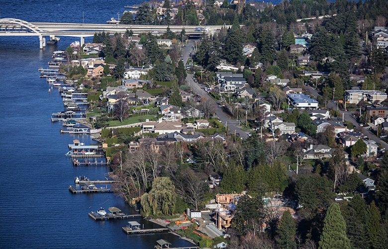

# King County Housing Data

## Introduction

In the following project, we examine and analyze data to determine the factors that most significantly contriubte to increased housing value. We will employ the OSEMN (obtain, scrub, explore, model, and interpret) data science process to determine the effect of various features on housing sales prices via a multivariate linear model.

The housing data utilized throughout this project comes from King County, Washington (shown below). King County comprises the greater Seattle area, including the city of Seattle and many surrounding suburbs to the North, East, and South. It is the most populous county in the state, with over 2 million residents, and the 12 most populous in the country.

## Objectives
Throughout this project we will aim to answer the following questions through exploratory analysis:
* How does **living space** affect the selling price of a home?
* How do **zip code** and **location** affect the selling price of a home?
* How do **age** and **time** affect the selling price of a home?
* How does the **ranking** assigned by King County affect a house's value?
* How does the **number of views** a house receives correlate with its value?
* How does the **condition ranting** of a house affect its selling price?

Ultimately our analysis and modeling process will culminate by answering the following essential question:
#### **Which factors most significantly contribute to increased housing value?**

## Data Science Process

Across the scope of the project, we touch upon various components of our data science process, depending on the research question at hand. However, the overall project from start to finish adheres to the OSEMN framework:

1. Obtain
2. Scrub
3. Explore
4. Model
5. Interpret

## Findings

Below, we provide several key visualizations developed throughout the exploratory data analysis, as well as our findings from the multivariate linear modeling process with regards to the top factors contributing to increased housing value.

**King County Home Sizes**

The above scatterplots display the correlation between different housing size factors and the selling price. Based on the twelve scatterplots, we notice that 'sqft_living15', 'sqft_living', and 'sqft_above' show the highest positive linear correlation with the selling price of the house. This indicates that larger living spaces reflect higher selling prices.

**Zip Codes**

In the above barplot, several zip codes rise to the top with much higher average selling prices per home than the mean selling price for all homes in King County (appoximately 540 thousand dollars). Notable zip codes include those containing the following neighborhoods: Medina, Mercer Island, Madison Park, Montlake, and Capitol Hill. Some of these neighborhoods are shown in the images below.

98039, 98040, 98004, and 98112 maintain the highest average selling prices for homes, with all four at a mean over 1 million dollars. 98039 is the zipcode for Medina, a neighborhood within Bellevue with residents such as Bill Gates and other extremely wealthy technology and business billionaires. 98004 is located just adjacent to 98039 and contains very high-end homes as well, at a lower mean than those in Medina, however, possibly due to its location slightly inland, as opposed to Medina's waterfront homes. 98040, located within Mercer Island, is well-known for extremely high-end housing, with easy access to Seattle jobs in the city center just across Lake Washington via the I-90 bridge. 98112, encompasing the Madison Park, Montlake, and north Capital Hill neighborhoods in Seattle, is well known for it's large mansions and extraordinarly high home prices. Kurt Kobain is a notable former resident of the neighborhood, with his memorial located at a park within 98112. The zipcode, located on the west side of Lake Washington contains a large number of waterfront homes and a very desirable location within the city with easy access to jobs and city attractions.

**Medina**

**Madison Park**

**Mercer Island**
